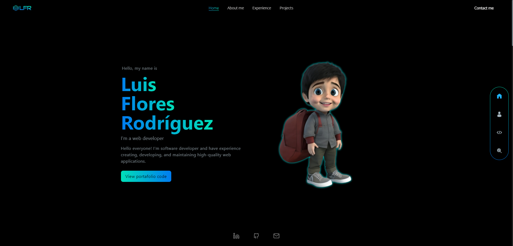

  
  <h2>Luis Gonzalo Flores Rodríguez</h2>

Hi everyone! This is my portfolio and it was created with the purpose of exposing to the world a little about my work and academic experience.

For the construction of this portfolio I used the following technologies:

<ul>
  <li>
    <a href='https://developer.mozilla.org/es/docs/Web/JavaScript'>Javascript</a> 
  </li>
  <li>
    <a href='https://es.react.dev/'>ReactJS</a> 
  </li>
  <li>
    <a href='https://tailwindcss.com/docs/installation'>Tailwind </a>
  </li>
  <li>
    <a href='https://www.framer.com/motion/'>Framer-motion</a>
    
  </li>
</ul>

And if you want to see the final results, you can enter this link - [luisgfr](https://www.luisgfr.com/)

---

## 🛠️ Instalation

To install this project it is essential to first have installed node, preferably one of the versions greater than 16, once this is taken into account, the following steps must be followed

**1. Install dependencies:**
`npm install`
It will install all the necessary packages for the project to run smoothly

**2. Run the project:**
`npm start`
Runs the app in the development mode.
Open http://localhost:3000 to view it in your browser.
The page will reload when you make changes.
You may also see any lint errors in the console.

**3. Build the project:**
`npm run build`
Builds the app for production to the build folder.
It correctly bundles React in production mode and optimizes the build for the best performance.
The build is minified and the filenames include the hashes.
Your app is ready to be deployed!
See the section about deployment for more information.

---

## Learn More

You can learn more in the [Create React App documentation](https://facebook.github.io/create-react-app/docs/getting-started).

To learn React, check out the [React documentation](https://reactjs.org/).

### Code Splitting

This section has moved here: [https://facebook.github.io/create-react-app/docs/code-splitting](https://facebook.github.io/create-react-app/docs/code-splitting)

### Analyzing the Bundle Size

This section has moved here: [https://facebook.github.io/create-react-app/docs/analyzing-the-bundle-size](https://facebook.github.io/create-react-app/docs/analyzing-the-bundle-size)

### Making a Progressive Web App

This section has moved here: [https://facebook.github.io/create-react-app/docs/making-a-progressive-web-app](https://facebook.github.io/create-react-app/docs/making-a-progressive-web-app)

### Advanced Configuration

This section has moved here: [https://facebook.github.io/create-react-app/docs/advanced-configuration](https://facebook.github.io/create-react-app/docs/advanced-configuration)

### Deployment

This section has moved here: [https://facebook.github.io/create-react-app/docs/deployment](https://facebook.github.io/create-react-app/docs/deployment)

### `npm run build` fails to minify

This section has moved here: [https://facebook.github.io/create-react-app/docs/troubleshooting#npm-run-build-fails-to-minify](https://facebook.github.io/create-react-app/docs/troubleshooting#npm-run-build-fails-to-minify)
